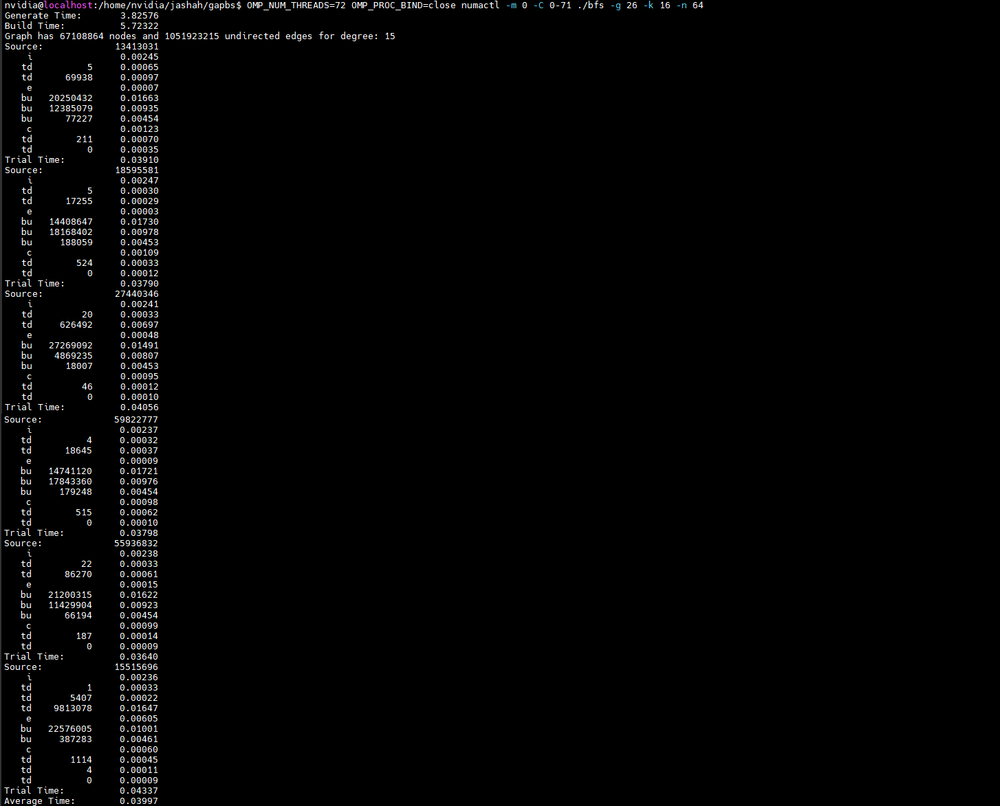

# GAP Benchmark Suite: Breadth First Search

The [GAP Benchmark Suite (Beamer, 2015)][1] was released with the goal of helping standardize graph processing evaluations. Graph algorithms and their applications are currently gaining renewed interest, especially with the growth of social networks and their analysis. Graph algorithms are also important for their applications in science and recognition. The GAP benchmark suite provides high performance (CPU only) reference implementations for various graph operations and provides a standard for graph processing performance evaluations. 

Even though the GAP benchmark suite provides real-world graphs and more than one kernel (high performance implementation of various graph operation algorithms), we will only look at using synthetic [Kronecker graphs](https://en.wikipedia.org/wiki/Kronecker_graph) and will be focusing on the [Breadth First Search (BFS)](https://en.wikipedia.org/wiki/Breadth-first_search) kernel.

## Initial Configuration

This repo is the reference implementation for the [GAP Benchmark Suite](http://gap.cs.berkeley.edu/). It is designed to be a portable high-performance baseline that only requires a compiler with support for C++11. It uses OpenMP for parallelism, but, to run serially, it can be compiled without OpenMP. The details of the benchmark can be found in the [specification][1].

## Quick Start

To build from source code: 

```bash
git clone https://github.com/sbeamer/gapbs.git 
cd gapbs
make
```

To quickly test the build, run the BFS kernel on 1024 vertices for one iteration:
```bash
./bfs -g 10 -n 1
```
Additional command line flags can be found with `-h`.

## Running the BFS kernel

After successfully building and running a test run, you can run the bfs kernel. Here are the command line options of interest:
- `-g <scale>`: generate Kronecker graph with `2^scale` vertices.
- `-k <degree>`: average degree for a synthetic graph.
- `-n <n>`: performs `n` trials.

Typically, we select a scale so that the working dataset size for the workload lies outside the Last level cache on the test platforms. A scale value of 26 means our graph will have approximately 67.11 million vertices. This graph size should be large enough so that the working set of the workload will not completely lie within the last level cache of the CPU. 

Run bfs with the following command:
```bash
OMP_NUM_THREADS=72 OMP_PROC_BIND=close numactl -m0 -C 0-71 ./bfs -g 26 -k 16 -n 64
```
This command will pin our application to CPU socket 0 and physical cores 0-71. 

## Output

When you run bfs using the command above on a Grace machine with atleast 72 cores, using Kronecker graph of scale 26 and degree 16 for 64 trials, we see an average time of approximately 0.0395 +/- 0.001 ms as shown in the figure below.

[](sample_output.png)


[1]: <http://arxiv.org/abs/1508.03619> "GAP Benchmark Suite"